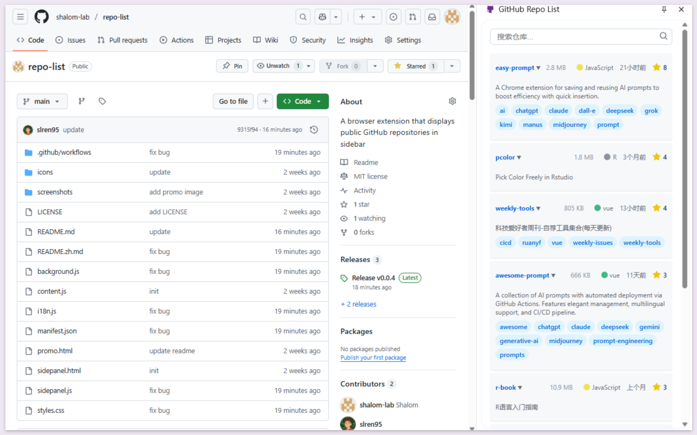
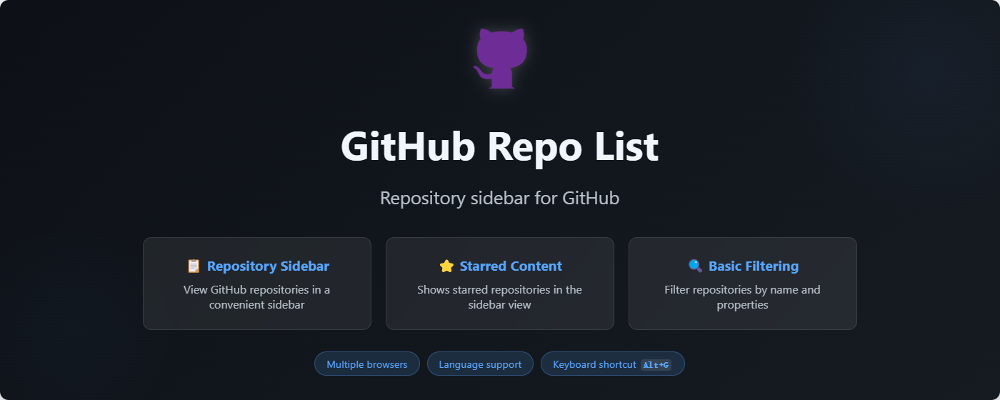

# GitHub Repo List

[English](README.md) | [中文](README.zh.md)

  

这是一个浏览器扩展，可以在侧边栏显示 GitHub 仓库，让您更轻松地浏览和搜索用户的仓库。支持12种语言，提供清晰的 GitHub 风格界面。

### 截图

  

### ✨ 主要功能

- 🔍 **智能侧边栏**
  - 访问 GitHub 用户主页时自动显示
  - 列出所有公开仓库及重要信息
  - 已加星标的仓库自动展开显示详情
  - 可折叠分区，更好地组织内容

- 📊 **仓库信息**
  - Star 数量（热门仓库星标高亮显示）
  - 最后更新时间（相对时间格式）
  - 编程语言及其颜色标识
  - 仓库描述和主题标签
  - 一键访问仓库

- 🌐 **多语言支持（12种语言）**
  - 中文（简体中文）
  - 英语（English）
  - 日语（日本語）
  - 韩语（한국어）
  - 法语（Français）
  - 德语（Deutsch）
  - 西班牙语（Español）
  - 葡萄牙语（Português）
  - 俄语（Русский）
  - 意大利语（Italiano）
  - 荷兰语（Nederlands）
  - 波兰语（Polski）

- 🔎 **高级搜索**
  - 按仓库名称筛选
  - 搜索仓库描述
  - 按编程语言筛选
  - 按主题标签搜索
  - 实时过滤结果

- 🎨 **视觉增强**
  - GitHub 风格界面，平滑动画效果
  - 星标与非星标仓库的视觉区分
  - 悬停效果和交互元素
  - 适应不同屏幕尺寸的响应式布局

  

### 🚀 安装方法

#### Chrome 网上应用店
1. 访问 [Chrome 网上应用店](https://chrome.google.com/webstore/detail/[extension-id])（即将上线）
2. 点击"添加至 Chrome"

#### 手动安装
1. 从 [Releases](https://github.com/shalom-lab/repo-list/releases) 下载最新版本
2. 解压下载的文件
3. Chrome/Edge/Brave 浏览器：
   - 打开 `chrome://extensions/`
   - 在右上角启用"开发者模式"
   - 点击"加载已解压的扩展程序"，选择解压后的文件夹
4. Firefox 浏览器：
   - 打开 `about:debugging`
   - 点击"此 Firefox"
   - 点击"临时载入附加组件"，选择解压文件夹中的 `manifest.json` 文件

### 💡 使用方法

1. 访问任意 GitHub 用户主页或仓库页面
2. 点击浏览器工具栏中的扩展图标或按下 `Alt+G` 快捷键打开侧边栏
3. 侧边栏将显示：
   - 顶部显示已获得 Star 的仓库（自动展开详情）
   - 可折叠区域显示未获得 Star 的仓库
4. 使用搜索框实时筛选仓库
5. 点击任意仓库即可访问
6. 点击仓库标题可展开/折叠详细信息

### 🌐 浏览器兼容性

- Google Chrome（88 版本及以上）
- Microsoft Edge（88 版本及以上）
- Firefox（90 版本及以上）
- Brave 浏览器
- Opera（74 版本及以上）

### 🤝 参与贡献

欢迎提交贡献！请随时提交 Pull Request。

如果您喜欢这个扩展，请考虑在 GitHub 上给它加星标！

### 📄 许可证

本项目采用 MIT 许可证 - 详情请查看 [LICENSE](LICENSE) 文件。 